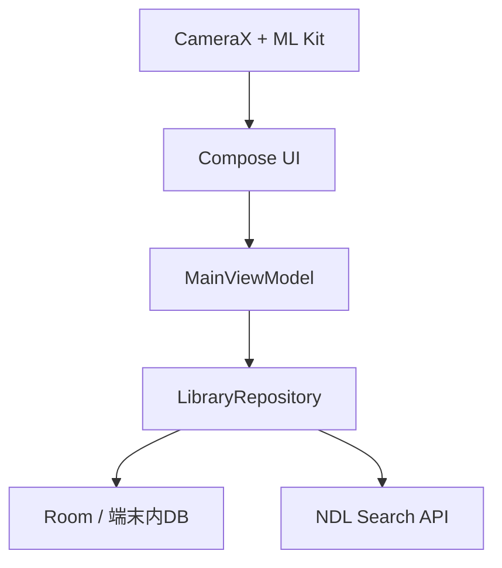

# NDC Shelf

スマートフォンで本のISBNバーコードを連続スキャンし、自分の蔵書を日本十進分類法（NDC）で整理する、Android向けの個人図書館アプリです。

> 現在の安定版は `v0.1.2` です。Pixel 7（Android 16）で、起動および「ISBNスキャン → 書誌情報取得 → 本棚登録」の一連の動作を確認しています。

## できること

- ISBN（EAN-13）をカメラで連続スキャン
- ISBN-10 / ISBN-13のチェックデジット検証
- 国立国会図書館サーチからタイトル、著者、出版社、出版年、NDCを取得
- Roomによる端末内の蔵書保存
- 登録済みISBNの重複警告
- タイトル、著者、ISBN、NDC、置き場所の横断検索
- 物理的な置き場所と読書状態の編集
- NDCの類別ごとの蔵書分布表示
- JSON / CSVによる蔵書データのエクスポート
- JSON / CSVからの検証・プレビュー付きインポート
- 書誌情報、NDC分類、棚位置、読書状態の手動補正と直後の取り消し
- 所有コピー単位の確認付き削除と直後の取り消し
- チェックサム・事前退避・原子的復元を備えたデータベース完全バックアップ
- ライトテーマ、ダークテーマ、Material You

## スクリーン

| 本棚 | スキャン | 分類 |
| --- | --- | --- |
| 蔵書の検索と編集 | バーコード連続登録 | NDC別の蔵書マップ |

スクリーンショットは最初の実機ビルド後に追加予定です。

## 技術スタック

- Kotlin 2.4 / Java 17
- Jetpack Compose + Material 3
- Room
- CameraX
- ML Kit Barcode Scanning（端末内モデル）
- Coil
- Coroutines / Flow
- Gradle Version Catalog

AGP 9のBuilt-in Kotlinを使用しているため、`org.jetbrains.kotlin.android` プラグインは適用していません。

## アーキテクチャ



データは次の3層に分けています。

- `BookWork`: 作品そのもの
- `BookEdition`: ISBN、出版社、表紙、NDCなど版固有の情報
- `OwnedCopy`: 所有状態、置き場所、読書状態

この分離により、同じ作品の紙版・電子版・改訂版や複数冊所蔵へ拡張できます。詳しくは [docs/ARCHITECTURE.md](docs/ARCHITECTURE.md) を参照してください。

## セットアップ

必要な環境:

- JDK 17
- Android SDK 37
- Android Studio（AGP 9.3対応版）またはコマンドライン環境

```bash
cd ndc-shelf-android
./gradlew testDebugUnitTest lintDebug
./gradlew installDebug
```

カメラやスキャン処理を変更した場合は、エミュレーターだけでなく実機でも確認してください。Codexなどの開発エージェント向けの作業ルールは [AGENTS.md](AGENTS.md) にまとめています。

NDL Search APIの利用にAPIキーは不要です。アプリはISBNの登録時だけ、対象ISBNをNDL Searchへ送信します。蔵書データは端末内に保存されます。

SRU APIには `recordPacking=xml` を明示し、DC-NDLの書誌要素をXMLとして取得・解析します。

## データ出典

本アプリの書誌情報およびNDC分類の一部は、[国立国会図書館サーチのAPI](https://ndlsearch.ndl.go.jp/help/api) を利用しています。データの内容や利用条件は、同サービスの案内をご確認ください。

## ロードマップ

- [x] 蔵書DB、検索、NDC分類、カメラスキャンの縦切り
- [x] 棚位置・読書状態の編集
- [x] ISBNとNDL XMLパーサーの単体テスト
- [x] JSON / CSVエクスポート
- [x] JSONインポート
- [x] CSVインポート
- [x] 書誌情報とNDCの手動補正
- [x] 蔵書コピーの削除と取り消し
- [x] Roomデータベースの完全バックアップと復元
- [ ] 本棚・部屋・段を管理する棚エディタ
- [ ] 書店モード（所有済み警告と欲しい本）
- [ ] 漫画・シリーズの巻数管理
- [ ] バックアップ同期（任意・オプトイン）
- [ ] AI司書（任意・オプトイン）

詳細は [docs/ROADMAP.md](docs/ROADMAP.md) を参照してください。

## コントリビューション

IssueやPull Requestを歓迎します。開発を始める前に [CONTRIBUTING.md](CONTRIBUTING.md) と [CODE_OF_CONDUCT.md](CODE_OF_CONDUCT.md) をご確認ください。脆弱性は公開Issueにせず、[SECURITY.md](SECURITY.md) の手順で報告してください。

## ライセンス

[Apache License 2.0](LICENSE)
