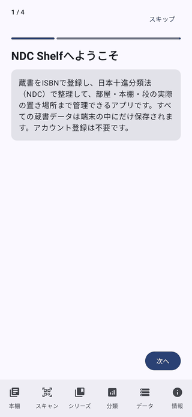
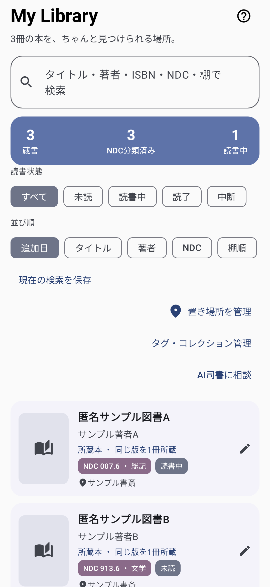
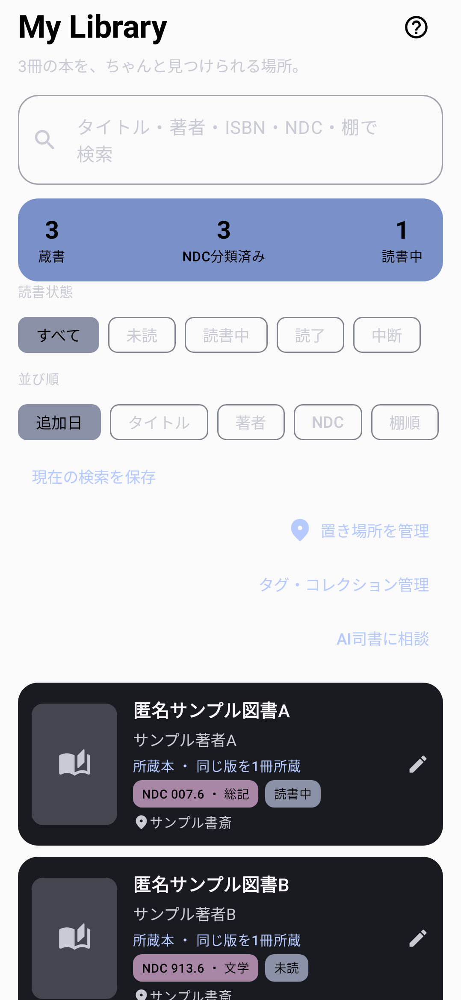
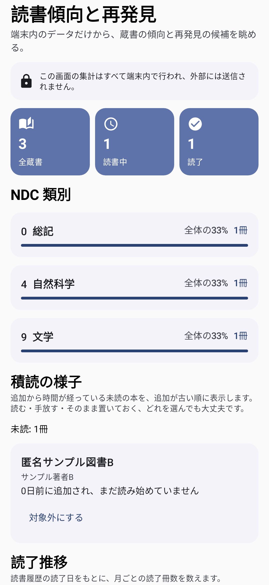
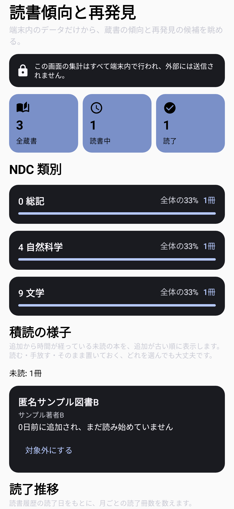
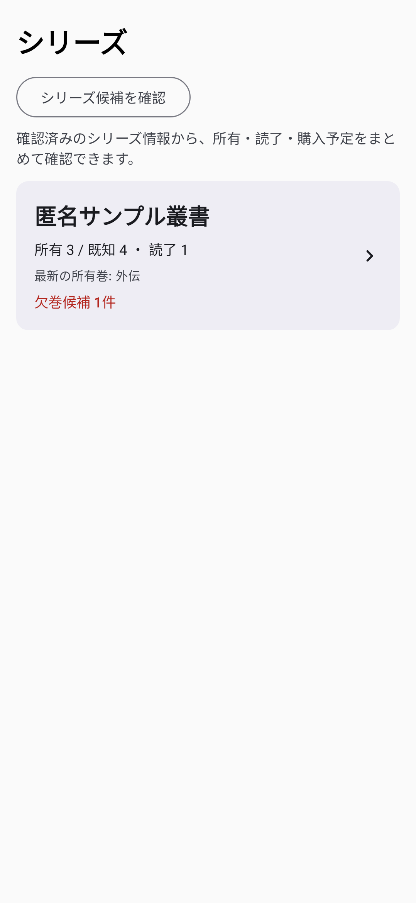
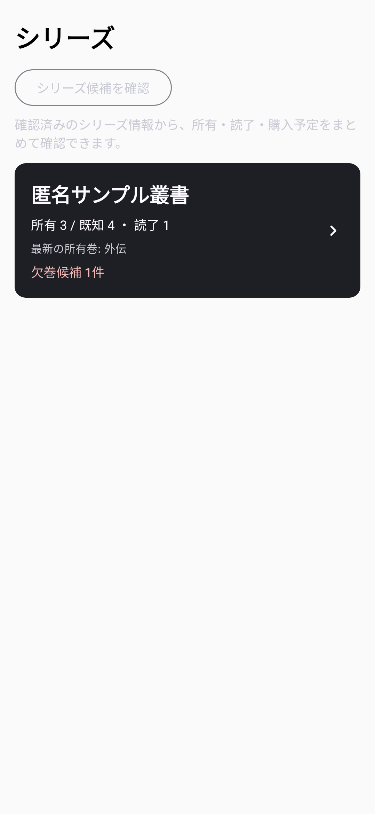
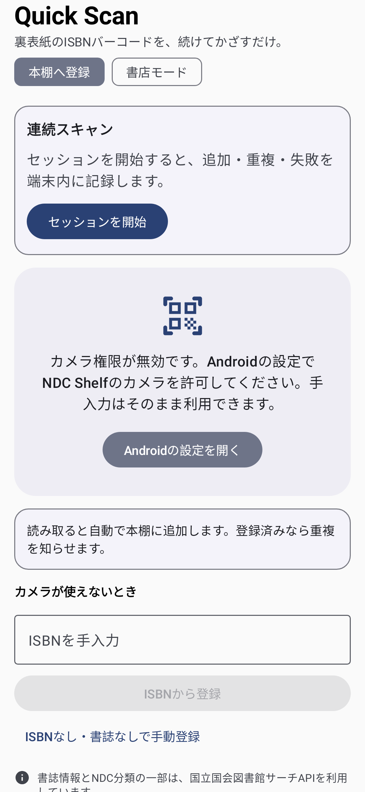
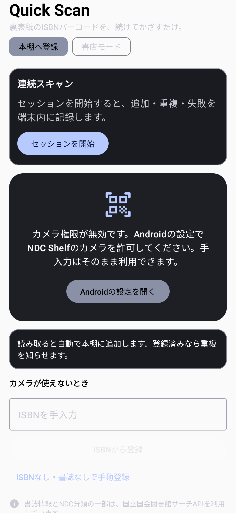
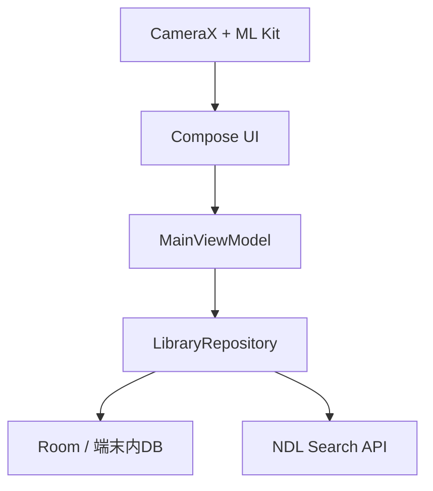

# NDC Shelf

スマートフォンで本のISBNバーコードを連続スキャンし、自分の蔵書を日本十進分類法（NDC）で整理する、Android向けの個人図書館アプリです。

> 現在の安定版は `v0.1.2` です。Pixel 7（Android 16）で、起動および「ISBNスキャン → 書誌情報取得 → 本棚登録」の一連の動作を確認しています。

## できること

- ISBN（EAN-13）をカメラで連続スキャン
- トーチ、ピンチズーム、タップフォーカス、成功フィードバック付きカメラスキャン
- ISBN-10 / ISBN-13のチェックデジット検証
- 国立国会図書館サーチからタイトル、著者、出版社、出版年、NDCを取得
- Roomによる端末内の蔵書保存
- 複数シリーズ所属、巻ラベル、外伝・合本を損失なく扱うシリーズ基盤
- シリーズ別の所有巻・既知巻・読了巻・最新所有巻と、確認済み本編だけの欠巻候補
- タイトルからのシリーズ・巻候補を編集し、新規または既存シリーズへ確認付きで一括登録
- 文庫・新装版・電子版を、版固有情報を残した可逆な作品グループとして確認付きで関連付け
- シリーズ単位の明示設定による、週1回の新刊書誌候補確認と重複しない通知
- 登録済みISBNの重複警告
- タイトル、著者、ISBN、NDC、置き場所の横断検索
- Room側の絞り込み、読書状態フィルター、追加日・書誌・NDC・棚順の並べ替え
- 部屋・本棚・段の階層による置き場所管理と読書状態の編集
- 段内の物理的な並び順と左右の隣接本による戻す位置の表示
- NDCの類別ごとの蔵書分布表示
- JSON / CSVによる蔵書データのエクスポート
- JSON / CSVからの検証・プレビュー付きインポート
- 書誌情報、NDC分類、棚位置、読書状態の手動補正と直後の取り消し
- 所有コピー単位の確認付き削除と直後の取り消し
- 同じ版の複数冊登録と、コピーごとの表示名・置き場所・読書状態管理
- 書店モードで所有冊数・欲しい・予約済みを確認し、購入時に本棚へ変換
- 連続スキャンのセッション件数・試行履歴と、安全な個別／一括取り消し
- チェックサム・事前退避・原子的復元を備えたデータベース完全バックアップ
- NDLで見つからない本のオフライン手動登録と、差分確認付きの後日照合
- 版の書誌・NDCと所有コピーを分けて確認できる書籍詳細画面
- 用途と影響を確認して操作できる専用データ管理画面
- プライバシー、NDL出典、アプリ情報、OSSライセンスのオフライン表示
- ライトテーマ、ダークテーマ、Material You
- 英語・日本語のUI（端末の言語設定に追従。日本語以外の端末では英語で表示）

## インストール

**NDC Shelfは無料のオープンソースアプリです。アプリストアでは配布せず、GitHub Releasesで署名付きAPKを提供します。**

1. [Releases](https://github.com/akaitigo/ndc-shelf-android/releases)から最新の `ndc-shelf-vX.Y.Z.apk` をダウンロードする
2. Androidの設定で、ブラウザまたはファイルアプリに「不明なアプリのインストール」を許可する
3. ダウンロードしたAPKを開いてインストールする

対応環境はAndroid 6.0（API 23）以降です。

### 配布物の検証（任意）

各Releaseには `SHA256SUMS.txt` と `apk-signature-vX.Y.Z.txt` を添付しています。

```bash
# 完全性の検証
sha256sum -c SHA256SUMS.txt

# 配布元の同一性の検証
apksigner verify --print-certs ndc-shelf-vX.Y.Z.apk
```

署名証明書のSHA-256は全リリースで次の値になります。異なる値のAPKは、この
リポジトリが配布したものではありません。

```
774a57fd47754271720da5a82f3820977f045a1592459e6c3f942e22f109cada
```

### 更新について

- 自動更新はありません。新版の告知はGitHub Releasesで行います（リポジトリをWatchすると通知を受け取れます）
- 更新は同じ署名鍵のAPKを上書きインストールするだけで、蔵書データは保持されます
- アプリ内の「データ」画面から、いつでもJSON / CSVエクスポートと完全バックアップを取得できます

## スクリーン



初回案内（カメラは任意・送信範囲の説明）→ 本棚で「未読の自然科学」と入力すると解釈がチップで表示される → 分類 → データ管理、までの操作です。

| 本棚 | スキャン | シリーズ | 分類 | データ | 情報 |
| --- | --- | --- | --- | --- | --- |
| 蔵書の検索と編集 | バーコード連続登録 | 所有巻・欠巻候補・読了状況 | NDC別の蔵書マップ | 移行・バックアップ・復元 | プライバシー・出典・ライセンス |

| ライト | ダーク |
| --- | --- |
|  |  |
|  |  |
|  |  |
|  |  |

画像はすべて匿名fixtureで、実在するISBN・氏名・置き場所を含みません。スクリーンショットは`ScreenshotRegressionTest`がCIで検証しているため、UIの変更に追随します。デモGIFの作り直しは`tools/build_demo_gif.py`の手順に従います。

## 対応言語

| 言語 | リソース | 備考 |
| --- | --- | --- |
| English | `app/src/main/res/values/strings.xml` | 既定（fallback）。日本語以外の端末はこちらを表示 |
| 日本語 | `app/src/main/res/values-ja/strings.xml` | 日本語ロケールの端末 |

端末の言語設定に追従します。ISBNとNDCコードは言語に依存しない識別子としてそのまま表示し、
日付・時刻・冊数の表記は端末のロケールに合わせます。翻訳方針、用語集、翻訳を追加する手順は
[docs/I18N.md](docs/I18N.md) を参照してください。

## 技術スタック

- Kotlin 2.4 / Java 17
- Jetpack Compose + Material 3
- Room
- CameraX
- ML Kit Barcode Scanning（端末内モデル）
- Coil
- Coroutines / Flow
- Gradle Version Catalog
- Room Testing + Robolectric（DB／Repositoryの必須JVM統合テスト）

AGP 9のBuilt-in Kotlinを使用しているため、`org.jetbrains.kotlin.android` プラグインは適用していません。

## アーキテクチャ



データは次の3層に分けています。

- `BookWork`: 作品そのもの
- `WorkGroup` / `WorkGroupMembership`: 版ごとのWorkを変更しない可逆な同一作品関係
- `Series` / `SeriesMembership`: 複数系列への所属、巻ラベル、種別、表示順
- `BookEdition`: ISBN、出版社、表紙、NDCなど版固有の情報
- `OwnedCopy`: 表示名、所有状態、置き場所、読書状態、取得日時
- `WishlistItem`: 未所有候補の欲しい・予約済み状態
- `ScanSession` / `ScanAttempt`: 直近の連続登録セッションと最小限の試行履歴

この分離により、同じ作品の紙版・電子版・改訂版や複数冊所蔵へ拡張できます。詳しくは [docs/ARCHITECTURE.md](docs/ARCHITECTURE.md) を参照してください。

## セットアップ

必要な環境:

- JDK 17
- Android SDK 37
- Android Studio（AGP 9.3対応版）またはコマンドライン環境

```bash
cd ndc-shelf-android
./gradlew testDebugUnitTest lintDebug
./gradlew installDebug
```

カメラやスキャン処理を変更した場合は、エミュレーターだけでなく実機でも確認してください。Codexなどの開発エージェント向けの作業ルールは [AGENTS.md](AGENTS.md) にまとめています。

暗所・小型バーコード・100冊連続・端末差の確認条件は[スキャン実機検証手順](docs/SCAN_DEVICE_TESTING.md)を使用してください。

通知権限、再起動、時計変更、バックアップ復元を含む新刊候補の確認は[シリーズ新刊候補の実機確認](docs/SERIES_WATCH_DEVICE_TESTING.md)を使用してください。

Room schemaとRepositoryのテスト構成、Migration追加手順は[docs/DATABASE_TESTING.md](docs/DATABASE_TESTING.md)を参照してください。

NDL Searchへの書誌・表紙通信、障害分類、再試行、表紙キャッシュの境界は[docs/NETWORK_BOUNDARY.md](docs/NETWORK_BOUNDARY.md)を参照してください。

大規模蔵書の代表データ、検索性能予算、Room・索引・Pagingの採否は[docs/LIBRARY_SEARCH_PERFORMANCE.md](docs/LIBRARY_SEARCH_PERFORMANCE.md)を参照してください。

利用者向け変更は[CHANGELOG.md](CHANGELOG.md)、v0.2の公開判定は[リリースチェックリスト](docs/releases/V0.2_RELEASE_CHECKLIST.md)、v0.3候補は[release notes](docs/releases/V0.3_RELEASE_NOTES.md)、[release checklist](docs/releases/V0.3_RELEASE_CHECKLIST.md)、[rollback手順](docs/releases/V0.3_ROLLBACK.md)、現在のv0.4候補は[release notes](docs/releases/V0.4_RELEASE_NOTES.md)、[release checklist](docs/releases/V0.4_RELEASE_CHECKLIST.md)、[rollback手順](docs/releases/V0.4_ROLLBACK.md)を参照してください。

NDL Search APIの利用にAPIキーは不要です。ISBN検索時は対象ISBNだけを送信し、シリーズの定期確認を明示的に有効にした場合だけ対象シリーズ名と検索開始年をシリーズごとに週1回送信します。一時障害時は失敗した確認だけを指数バックオフで再試行します。蔵書データは端末内に保存され、Androidのクラウドバックアップからも除外されます。Android 9以降の端末間転送ではRoom DBだけを移行対象にします。表紙表示時はNDL SearchのHTTPS画像URLへ接続し、最大50MiBの端末キャッシュを利用します。バーコード画像と認識結果はML Kitにより端末内処理されますが、同SDKは診断・利用分析メトリクスをGoogleへ送信します。詳しい取扱いは[PRIVACY.md](PRIVACY.md)、バックアップ判断は[docs/BACKUP_THREAT_MODEL.md](docs/BACKUP_THREAT_MODEL.md)を参照してください。

SRU APIには `recordPacking=xml` を明示し、DC-NDLの書誌要素をXMLとして取得・解析します。

## データ出典

本アプリは[国立国会図書館サーチのAPI](https://ndlsearch.ndl.go.jp/help/api)を利用しています。書誌情報およびNDC分類の一部は同サービスと[メタデータ提供機関](https://ndlsearch.ndl.go.jp/help/api/provider)に由来します。データの内容や利用条件は各提供元の案内をご確認ください。

## ロードマップ

- [x] 蔵書DB、検索、NDC分類、カメラスキャンの縦切り
- [x] 棚位置・読書状態の編集
- [x] ISBNとNDL XMLパーサーの単体テスト
- [x] JSON / CSVエクスポート
- [x] JSONインポート
- [x] CSVインポート
- [x] 書誌情報とNDCの手動補正
- [x] 蔵書コピーの削除と取り消し
- [x] 同じ版の複数冊所蔵
- [x] Roomデータベースの完全バックアップと復元
- [x] 本棚・部屋・段を管理する棚エディタ
- [x] 書店モード（所有済み警告、欲しい本、予約済み）
- [x] 連続スキャンのセッション履歴と安全な一括取り消し
- [x] 漫画・シリーズの所有巻・欠巻候補・読了状況の可視化
- [x] シリーズ候補の編集・一括確定・関連解除
- [x] 版違いの可逆な作品グループと任意のシリーズ代替判定
- [x] オプトインのシリーズ新刊候補確認
- [ ] シリーズ統合
- [ ] バックアップ同期（任意・オプトイン）
- [ ] AI司書（任意・オプトイン。規則ベースの提案で提供中。自然文で提案する端末内LLMは、推論エンジンとモデルを未同梱のため利用できません。詳細は[ADR 0009](docs/adr/0009-on-device-llm-librarian.md)）

詳細は [docs/ROADMAP.md](docs/ROADMAP.md) を参照してください。将来の任意同期は、実装前に固定した[公開protocol](docs/SYNC_PROTOCOL.md)と[脅威モデル](docs/SYNC_THREAT_MODEL.md)に従います。

## コントリビューション

IssueやPull Requestを歓迎します。開発を始める前に [CONTRIBUTING.md](CONTRIBUTING.md)、[Repository governance](docs/REPOSITORY_GOVERNANCE.md)、[CODE_OF_CONDUCT.md](CODE_OF_CONDUCT.md) をご確認ください。脆弱性は公開Issueにせず、[SECURITY.md](SECURITY.md) の手順で報告してください。

## ライセンス

[Apache License 2.0](LICENSE)
