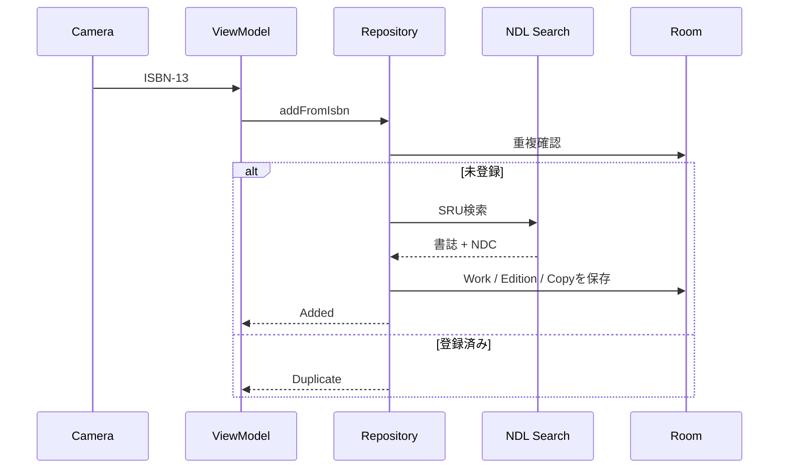
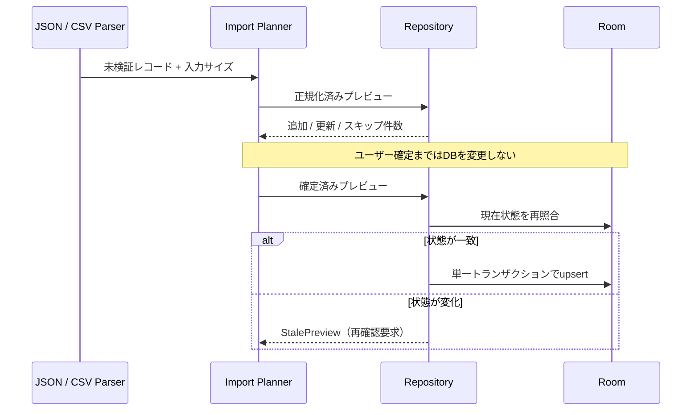

# Architecture

## 方針

NDC Shelfは、最初のリリースでは単一のAndroidアプリモジュールに保ちます。パッケージ境界で責務を分け、ビルド時間や変更頻度が分離のコストを上回った時点でマルチモジュール化します。

## パッケージ

| パッケージ | 責務 |
| --- | --- |
| `domain/model` | UIや保存方法に依存しない蔵書モデル |
| `domain/export` | バージョン付きJSONと安全なCSVの逐次出力 |
| `domain/importer` | 形式非依存の入力検証、競合解決、プレビュー、原子反映 |
| `domain/backup` | 永続的な蔵書データの版付きバックアップ形式と入力検証 |
| `domain/repository` | ユースケースから見たデータ操作の契約 |
| `data/local` | RoomのEntity、DAO、Database |
| `data/backup` | Roomトランザクションによる完全退避と原子的復元 |
| `data/remote` | NDL Search SRUクライアントとXML解析 |
| `data/repository` | ローカル・リモートデータの統合 |
| `scanner` | ISBN検証とリアルタイムバーコード解析 |
| `ui` | Compose画面、テーマ、表示部品 |
| `ui/navigation` | 型安全route定義とタブ構成（規則は[NAVIGATION.md](NAVIGATION.md)） |

## 登録フロー



`CameraPreview`はbindした`CameraControl`だけを通じて、対応端末のトーチ、CameraInfoの倍率範囲内のズーム、対応するAF/AE測光点を操作します。トーチ状態は画面をまたいで自動復元せず、画面破棄時に必ずOFFへ戻します。非同期CameraProviderは破棄済み画面へbindせず、`ImageAnalysis.clearAnalyzer()`、ML Kit scannerのclose、専用Executorのshutdown、use caseのunbindを同じ終了処理で行います。

## インポートフロー



形式パーサーとUIは必ず共通インポート基盤を経由します。詳細な上限、競合方針、ロールバック条件は[IMPORT_SAFETY.md](IMPORT_SAFETY.md)を参照してください。
通常のJSON / CSVインポートは作品グループを推測せず、新規Workを未所属のまま保存します。内部IDと確定済み作品グループを含む移行は、完全バックアップ形式v11以降だけを使用します。

## 目的別同意（consent）

外部通信する任意機能は`domain/consent`の`ConsentPurpose`で目的を宣言し、既定OFFとします。同意はRoomの`consent_records`（v13）へ目的・説明版・日時で記録し、完全バックアップへ含めず復元でも変更しません。ネットワーク境界の直前（例: `SeriesWatchRunner`）で`ConsentRepository.isGranted`を確認するfail-closed構成とし、UIの状態だけに依存しません。説明文を意味変更する場合は該当`ConsentPurpose.policyVersion`を上げ、再同意されるまで通信を停止します。同意UIは「データ」タブの`ConsentRoute`と、各機能の初回有効化時の`ConsentPayloadDialog`（実ペイロード項目の提示）だけです。

## データ管理UI

エクスポート、インポート、完全バックアップ、復元の入口は下部ナビゲーションの「データ」画面へ集約します。本棚画面へ個別のデータ操作を追加してはいけません。非破壊操作と現在DBを置き換える復元を別セクションに分け、個人データ、暗号化範囲、上書き有無を実行前から表示します。

ISBNなし資料の登録、書誌由来、確認付きNDL照合の不変条件は[MANUAL_REGISTRATION.md](MANUAL_REGISTRATION.md)を参照してください。

Storage Access FrameworkのActivity Result launcherは、遷移先画面ではなく`NdcShelfApp`ルートで常に同じ順序で登録します。これにより、画面回転やプロセス再生成後も保留中の結果が対応するコールバックへ返ります。実際の書き出し、インポート、バックアップ状態はViewModelが保持し、処理中は競合する操作を無効化します。

完全バックアップの形式、入力上限、復元ロールバックは[DATABASE_BACKUP.md](DATABASE_BACKUP.md)を参照してください。

## シリーズモデル

WorkとSeriesは独立し、`SeriesMembership`で0対多を表現します。巻ラベルと種別は表示事実、fractional order keyは表示順として分離し、タイトルから暗黙に推測しません。`RoomSeriesRepository`はMembershipをEdition・Copy・Wishlistへ集約し、Composeへ所有・読了・購入予定状態をFlowで提供します。欠巻候補は確認済みMembershipのうち明示的な巻ラベルを持つ本編だけであり、番号の穴から未知の巻を生成しません。Room v8の外部キー・一意制約、複数所属、削除・統合・同期の判断は[シリーズモデル](SERIES_MODEL.md)と[ADR 0002](adr/0002-multiple-series-memberships.md)を参照してください。

タイトル解析結果は`SeriesSuggestion`としてメモリ上だけに置き、画面表示や高信頼度を理由に自動保存しません。利用者が編集・確定した一冊または一括候補だけを単一Room transactionでMembershipへ変換し、Room v9の`origin`、`confirmedBy`、`sourceTitle`へ由来を保存します。表示後にWorkタイトルが変化した候補、重複所属、同名シリーズ作成はfail-closedで競合として扱います。

## 版違いモデル

単行本、文庫、新装版、電子版は既存の`BookWork`と`BookEdition`を変更せず、`WorkGroup`と`WorkGroupMembership`で可逆に関連付けます。タイトルと著者の正規化結果は候補表示だけに使い、自動保存しません。確定前に双方のISBN、出版社、出版年、NDC、表紙、媒体、所有冊数とシリーズへの影響を表示し、確定時に現在タイトルと所属を再検証します。

1 Workは最大1 Groupに所属します。解除はMembershipだけを削除し、Work、Edition、OwnedCopy、WishlistItem、SeriesMembershipを変更しません。Groupが2件未満になれば残存MembershipとGroupを削除します。`seriesSubstitutionEnabled`を利用者が有効にしたGroupだけ、同じGroupの別Workに属する版をシリーズ充足へ含めます。詳細な判断は[ADR 0003](adr/0003-reversible-work-groups.md)を正本とします。

## 書籍詳細UI

本棚一覧からは`BookEdition`単位の詳細へ遷移し、タイトル、著者、ISBN、出版社、出版年、表紙、NDC、書誌出典を表示します。同じEditionを参照する`OwnedCopy`は場所、読書状態、媒体、取得日とともに列挙し、棚移動、状態変更、コピー名変更、削除は選択したコピーの編集シートだけで行います。書誌・分類の手動補正と確認付きNDL照合はEdition共通操作として分離し、破壊的なコピー削除を詳細画面へ直接配置しません。

詳細選択と編集中のcopy IDは`rememberSaveable`で保持します。外部からの`ndcshelf://book/{editionId}`は、英数字と`._:-`だけからなる128文字以下のローカルEdition IDに限定し、該当する端末内データがある場合だけ詳細を開きます。MainActivityは`singleTop`で、起動中のリンクを`onNewIntent`へ集約しActivityの多重生成を防ぎます。カスタムスキームはドメイン検証されたApp Linkではないため他アプリによる横取りを防げませんが、リンクから蔵書データの読出しや変更は行わず、ローカル画面への移動だけを許可します。処理待ちIDはActivityの保存状態で管理し、消費済みリンクを画面回転後に再実行しません。

## 読書履歴モデル

読書の開始・中断・再開・読了は`ReadingSession`（Room v14の`reading_sessions`）として`OwnedCopy`ごとに記録し、再読は同じコピーへの新しいセッション追加として表します。識別子は端末間で衝突しない独立UUIDで、追加・編集・削除は他のRepositoryと同様に`SyncMutationJournal`へ`readingSession`のupsert / deleteとして同一トランザクションで記録します。コピー削除時は履歴の同期deleteも明示的に記録し、同期経由で他端末の履歴を黙って上書き消失させません。削除直後の取り消しは、同じIDが残る場合や同期tombstoneがある場合に新IDで復元するfail-closed構成です。

日付は「2026」「2026-07」「2026-07-29」の部分日付（`PartialDate`）をローカル暦日のTEXTとして保存し、時刻・タイムゾーンを持たないため端末の時刻ずれの影響を受けません。日付不明はnullで表し、開始日と読了日は共通precisionだけで比較して矛盾（読了が開始より前）を拒否します。同一コピー内の同一内容セッションは重複イベントとして拒否し、進行中（READING / PAUSED）のセッションはコピーごとに最大1件です。

`owned_copies.readingStatus`との整合規則: 履歴を変更するたびに、READINGがあればREADING、なければPAUSED、なければFINISHEDがあればREADへコピー状態を導出・更新します。履歴0件のコピーは状態を変更せず、コピー状態の手動編集から履歴を自動生成しません（推測で履歴を作らない）。v13→v14 Migrationも同じ理由で既存の`readingStatus`からセッションを生成せず、空テーブルの追加だけを行います。

評価（1〜5）とメモ（最大2,000文字）は端末内にだけ保存します。完全バックアップ（形式v13）の対象で、JSON / CSVエクスポート・インポートと蔵書検索の対象外、外部送信は行いません。分析画面の傾向表示には読了状況と読了日だけを使い、その方針を詳細画面の履歴セクションに明示します。

## タグとコレクション

タグ（Room v15の`tags` / `tag_assignments`）は作品（`BookWork`）単位で付与する。ジャンル・テーマのような内容の分類は版・冊ではなく作品に属し、置き場所・読書状態・コピー名など物理属性は既存のコピー単位モデルが担うためである。1作品へ複数タグを付与でき、（tagId, workId）の重複付与は一意制約で1件に正規化する。識別子は端末間で衝突しない独立UUIDで、追加・名称変更・色変更・統合・削除・付与/解除はすべて`SyncMutationJournal`へ`tag` / `tagAssignment`のupsert / deleteとして同一トランザクションで記録する。作品が削除される全経路（コピー削除・スキャン取り消し・NDL照合の統合）でも付与のdeleteを明示記録し、同期経由の上書き消失を防ぐ。

コレクションの責務は2種類に分ける。**手動コレクションはタグそのもの**であり、独立モデルを持たない（「積読」「貸出中」のような集合はタグとして作る。集合表示は本棚のタグ絞り込みで得られ、モデル二重化と同期対象の増加を避ける）。**検索条件コレクションは`saved_searches`**で、検索語・読書状態・並び順・タグ集合をcriteriaJsonとして保存し、蔵書への参照を持たない。適用時は保存済み条件で本棚の検索条件を置き換えるだけで、蔵書を変更しない。

タグ名・コレクション名は`TagNameRules`で検証する: 前後空白の除去と連続空白の1つへの正規化、空・50文字超・制御文字の拒否、正規化後の完全一致の重複拒否。件数上限はタグ100件・保存済み検索50件・タグ絞り込み10件で、大量タグによる検索クエリ肥大とUI劣化を抑える。本棚検索のタグ条件はAND（選択タグを全て含む作品）で、`EXISTS`のID等値比較だけを使いタグ名を`LIKE`へ渡さない。

タグ名は**信頼できない入力**として扱う。表示はComposeの`Text`によるプレーンテキスト描画だけを使い、HTML・マークアップ・リンクとして解釈しない。将来の自然言語検索(#40)・再発見(#41)がタグを利用する場合も、タグ名をプロンプトやログへ命令として渡さず、引用データとして分離すること（AIへの入力は同意ゲート(#43)配下）。エクスポート・バックアップの対象は、JSON v4（タグ定義と蔵書ごとのタグ名、往復可能）、完全バックアップ形式v14（ID・付与・保存済み検索を含む正本）で、CSVは18列互換維持のため対象外とする（docs/EXPORT_FORMAT.md）。保存済み検索はタグIDを参照するため、内部IDを持たないJSONエクスポートへは含めず、完全バックアップだけで移行する。

## 分析（Insights）

分析タブの読書傾向（積読期間、NDC類、読了推移）とランダム再発見は、`domain/insights`の`LibraryInsightsCalculator`が蔵書・読書セッション・除外リスト・現在時刻・乱数seedを引数に取る純粋関数として集計します。集計は端末内だけで行い外部送信せず、候補には保存済みの事実だけから導いた「選ばれた理由」を必ず添えます。読了日つきの履歴が閾値未満の指標はグラフを表示せず、必要なデータを説明します（fail-safeな断定回避）。

画面は`InsightsViewModel`（画面スコープ）が`LibraryRepository.observeLibrary()`、`ReadingHistoryRepository.observeAllSessions()`、`InsightsExclusionStore`を`combine`して状態を導出します。候補の「対象外にする」と「分析リセット」はSharedPreferences（`insights-exclusions`）ベースの除外ストアで永続化し、Room schemaを変更しません。除外は候補の提示だけに影響し、集計値・蔵書・履歴・同期・バックアップへは影響しません。指標の定義・限界・表現ガイドライン・TalkBack対応は[INSIGHTS.md](INSIGHTS.md)を正本とします。

## 蔵書検索

本棚の検索・読書状態・並び順は`LibrarySearchCriteria`で表し、250msの入力待機後に`flatMapLatest`でRoomのObservable Queryを切り替えます。UIへは適用済み条件と結果を同じ`LibrarySearchResult`として渡し、入力中の条件と一致しない古い結果を表示しません。検索語は100文字に制限し、SQL `LIKE`の`%`、`_`、エスケープ文字はリテラルとして扱います。

検索語、読書状態、並び順はアプリ専用SharedPreferencesへ保存し、詳細表示中だけ使うEdition IDは永続化しません。全蔵書Flowは本棚または分析画面の表示中だけ購読し、データ画面の件数は集計クエリ、エクスポートは実行時スナップショットを使います。代表データ、性能予算、索引・FTS・Pagingの判断は[LIBRARY_SEARCH_PERFORMANCE.md](LIBRARY_SEARCH_PERFORMANCE.md)を正本とします。

## データモデル

```mermaid
erDiagram
    BOOK_WORK ||--o{ BOOK_EDITION : has
    WORK_GROUP ||--|{ WORK_GROUP_MEMBERSHIP : contains
    BOOK_WORK ||--o| WORK_GROUP_MEMBERSHIP : grouped_as
    BOOK_EDITION ||--o{ OWNED_COPY : owned_as
    BOOK_EDITION ||--o| WISHLIST_ITEM : planned_as
    LOCATION_ROOM ||--o{ LOCATION_SHELF : contains
    LOCATION_SHELF ||--o{ LOCATION_TIER : contains
    LOCATION_TIER ||--o{ OWNED_COPY : stores
    SCAN_SESSION ||--o{ SCAN_ATTEMPT : records
    BOOK_WORK {
        string id PK
        string title
        string primaryAuthor
    }
    WORK_GROUP {
        string id PK
        string title
        boolean seriesSubstitutionEnabled
    }
    WORK_GROUP_MEMBERSHIP {
        string id PK
        string groupId FK
        string workId UK_FK
    }
    BOOK_EDITION {
        string id PK
        string workId FK
        string isbn13 UK
        string ndcCode
        string coverUrl
    }
    OWNED_COPY {
        string id PK
        string editionId FK
        string location
        string tierId FK
        string shelfOrderKey
        string readingStatus
        string copyLabel
        long addedAt
    }
    WISHLIST_ITEM {
        string editionId PK_FK
        string status
        long createdAt
        long updatedAt
    }
    SCAN_SESSION {
        string id PK
        long startedAt
        long endedAt
    }
    SCAN_ATTEMPT {
        string id PK
        string sessionId FK
        string isbn
        string outcome
        string copyId
        string copySnapshot
        long attemptedAt
        long undoneAt
    }
    LOCATION_ROOM {
        string id PK
        string name UK
        int sortOrder
    }
    LOCATION_SHELF {
        string id PK
        string roomId FK
        string name
        int sortOrder
    }
    LOCATION_TIER {
        string id PK
        string shelfId FK
        string name
        int sortOrder
    }
```

`BookEdition.isbn13`はユニークです。同じISBNを再スキャンした場合は既存Editionを再利用し、新しい`OwnedCopy`だけをトランザクションで追加します。`OwnedCopy.copyLabel`、置き場所、読書状態、取得日時はコピー固有であり、一覧では同一Editionを参照するコピー数と表示名を併記します。Edition共通の書誌情報とコピー固有情報をUI上でも分離し、削除対象は必ずコピー単位で示します。

`SeriesWatch`はシリーズ単位の明示的な外部確認設定、`SeriesReleaseCandidate`はNDLで確認した書誌候補と通知状態を保持します。初回取得は基準線として通知せず、決定的な候補IDと`notifiedAt`で後続の重複通知を防ぎます。ISBNが一致する候補は`OwnedCopy`と`WishlistItem`から所有済み・欲しい・予約済みを導出し、候補へ蔵書状態を複製しません。

### 書店モード

未所有の購入候補は`OwnedCopy`を作らず、Editionに対して最大1件の`WishlistItem`として保存します。永続化する`PurchaseStatus`は`WANTED`と`RESERVED`だけで、読書状態とは別の列挙です。`PURCHASED`は保存状態ではなく遷移命令とし、単一トランザクションで既存Editionを再利用した`OwnedCopy`を追加して`WishlistItem`を削除します。すでに所有しているEditionにも追加購入の予定を持てます。

書店モードのISBN照会は、RoomにあるEdition、所有冊数、購入候補をネットワークより先に検索します。保存済みISBNはオフラインでも状態を表示し、端末内にないISBNだけNDL Searchへ送信します。最後のOwnedCopyを削除しても同じEditionの`WishlistItem`が残る場合は、EditionとWorkを削除してはいけません。蔵書インポートで同じISBNが追加された場合は既存Editionを再利用し、購入済みへの遷移として候補を削除します。

連続スキャンは`ScanSession`と`ScanAttempt`へセッション時刻、ISBN、結果、追加copyIdだけを保存し、書誌情報を複製しません。追加時の作品・版・コピーの全項目は長さ付き正規化後にSHA-256化して保持し、個別・一括取り消し時に現在値と一致したコピーだけを削除します。一括操作は1件でも不一致なら全体をロールバックします。履歴は直近20セッションに制限し、完全バックアップには復旧可能性を保つため含めます。JSON／CSVには含めません。

### 置き場所

構造化した置き場所は`LocationRoom`→`LocationShelf`→`LocationTier`の3階層とし、`OwnedCopy.tierId`から段だけを参照します。表示時は親を結合して`部屋 / 本棚 / 段`とします。部屋名は全体、本棚名と段名は同一親内で完全一致を禁止し、表示区切りと曖昧になる`/`は使用できません。各階層は`sortOrder`の昇順とし、同値の場合は名前、IDの順で安定化します。並べ替え後は同一親の順序を0始まりの連番へ正規化します。

旧`OwnedCopy.location`は互換用の原文として残します。v1からv2へのMigrationでは値を分割・推測せず、`tierId = NULL`のまま一字も変更しません。段を割り当てたコピーだけ構造化パスを表示し、未割り当ては旧文字列を表示します。使用中の部屋・本棚・段は、配下コピーの移動先または明示的な未設定化を指定しない限り削除しません。

段内の物理順は`OwnedCopy.shelfOrderKey`で管理します。キー生成と同期競合時のtie-breakerは[ADR 0001](adr/0001-fractional-shelf-order-key.md)を正本とし、通常操作で段全体の連番を更新してはいけません。

### 手動補正の優先順位

詳細編集では、タイトル・著者を`BookWork`、出版社・出版年・NDCを`BookEdition`、置き場所・読書状態を`OwnedCopy`へ単一トランザクションで保存します。入力は保存前に前後空白、必須項目、文字数、出版年、NDCコードを検証します。

NDCコードまたはNDC版を変更した場合、`classificationSource`を`MANUAL`にします。同じISBNを再スキャンしても既存蔵書の重複判定をNDL取得より先に行うため、手動値を上書きしません。将来NDL再取得機能を追加する場合も、`MANUAL`の分類値は明示確認なしに更新してはいけません。

保存直後は変更前と変更後のスナップショットを保持し、Snackbarから取り消せます。取り消し時点のDBが保存直後の状態と一致する場合だけ、3テーブルを単一トランザクションで復元します。別操作による変更を検出した場合は復元を拒否します。

### 所有コピーの削除

削除単位は`OwnedCopy`であり、同じ`BookEdition`を参照する別コピーを削除しません。削除トランザクション内でコピーを削除した後、参照コピーが0件になった`BookEdition`と、参照Editionが0件になった`BookWork`だけを順に削除します。親を先に削除して外部キー`CASCADE`へ依存する実装は禁止します。

削除直後の取り消しは、削除したコピーと必要な親行のスナップショットを単一トランザクションで復元します。同じIDまたはISBNが再利用されている場合や、共有親の内容が変わった場合は既存データを上書きせず競合として拒否します。

## プライバシー

- 蔵書DBは端末内に保存します。
- バーコード認識は端末内で処理します。
- 書誌情報の検索時にISBNをNDL Searchへ送信します。
- アナリティクスSDKや広告SDKは組み込みません。
- 将来の同期やAI機能は明示的なオプトインにします。

## Optional sync boundary

任意同期はRoomを正本とするE2EE operation logとして設計し、backendへdomain payloadの平文を渡しません。同期対象、除外data、公開wire format、因果順序、remove-wins削除、端末追加・失効、鍵紛失、backend交換の規則は[ADR 0005](adr/0005-optional-e2ee-sync.md)と[同期protocol](SYNC_PROTOCOL.md)を正本とします。信頼境界、STRIDE分析、復旧と残存riskは[同期脅威モデル](SYNC_THREAT_MODEL.md)を参照してください。

Room v12はlocal mutationと平文journalを同一transactionで記録し、device counter、received / processed cursor、field winner、remove-wins tombstone、ack、domain conflictをapp-private DBへ保持します。重複・順不同操作はoperation IDとversion vectorで冪等に処理し、同時field更新はdotで決定的に収束させつつloserを競合証跡へ残します。完全バックアップ復元では同期内部状態を消去し、新device IDでの再登録を要求します。

Room v16は同期identity、Keystore wrapping keyで暗号化した鍵blob、検証済みdevice registry cache、招待、処理済みenvelope、security quarantineを保持します。`SyncBackend` interfaceがtransport契約（capability、head CAS、content-addressed object、registry、device envelope、remote削除）を定義し、参照実装の`FolderSyncBackend`は利用者が選んだフォルダ（SAF）へE2EE ciphertextだけを保存します。TLS・認証・期限切れ・rate limit・サービス停止・権限喪失・容量不足は`SyncBackendErrorKind`で分類し、retry可否をenumで判定します。

`E2eeSyncCoordinator`が有効化、genesis / bootstrap snapshot、手動同期、端末追加・承認・失効、sign-out、remote全削除を担います。content暗号はepoch keyから導出したdevice subkeyとAES-256-GCM、nonceは永続encryption counter由来で再利用しません。端末追加はRFC 9180 HPKE（Tink）でepoch keyをwrapし、失効はregistry generationを進めて新epochへrotationします。検証（size→suite→protocol→epoch→device authorization→署名→object hash→AEAD→schema）に失敗したobjectはquarantineへ保存して同期を停止し、domainへ適用しません。同期OFF、同意なし、撤回後、sign-out後は同期先へrequestを作成せず、鍵生成もフォルダアクセスも行いません。wall clock、backend固有timestamp、全量last-writer-winsを競合解決へ使用してはいけません。
