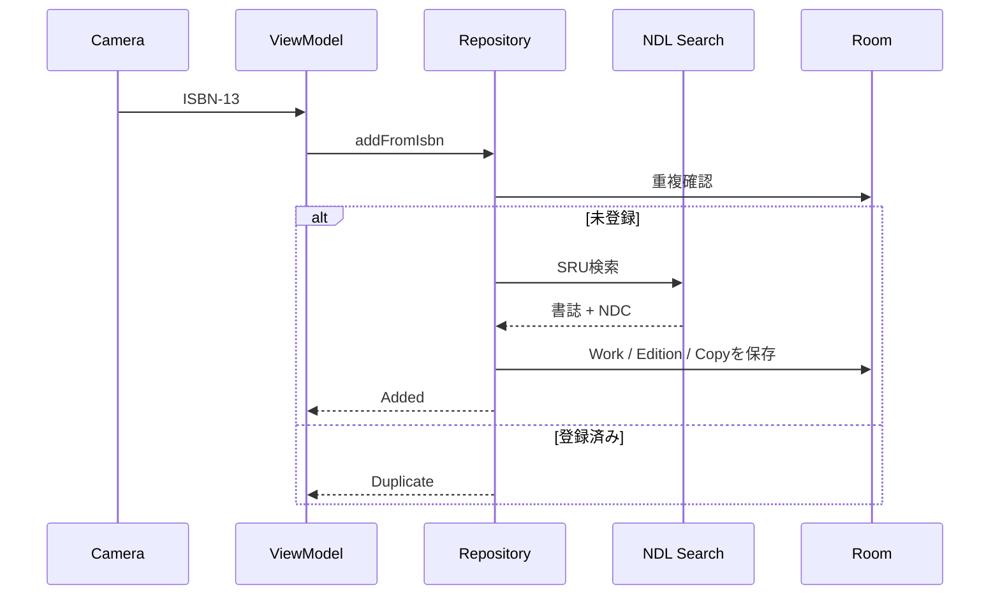
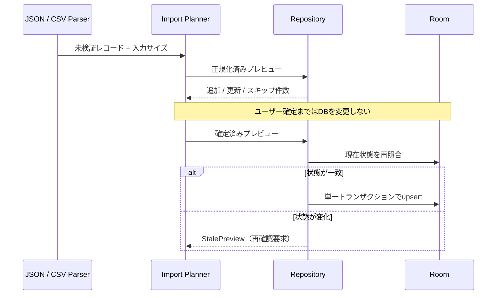
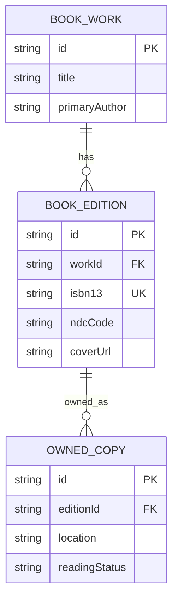

# Architecture

## 方針

NDC Shelfは、最初のリリースでは単一のAndroidアプリモジュールに保ちます。パッケージ境界で責務を分け、ビルド時間や変更頻度が分離のコストを上回った時点でマルチモジュール化します。

## パッケージ

| パッケージ | 責務 |
| --- | --- |
| `domain/model` | UIや保存方法に依存しない蔵書モデル |
| `domain/export` | バージョン付きJSONと安全なCSVの逐次出力 |
| `domain/importer` | 形式非依存の入力検証、競合解決、プレビュー、原子反映 |
| `domain/backup` | 全Roomテーブルの版付きバックアップ形式と入力検証 |
| `domain/repository` | ユースケースから見たデータ操作の契約 |
| `data/local` | RoomのEntity、DAO、Database |
| `data/backup` | Roomトランザクションによる完全退避と原子的復元 |
| `data/remote` | NDL Search SRUクライアントとXML解析 |
| `data/repository` | ローカル・リモートデータの統合 |
| `scanner` | ISBN検証とリアルタイムバーコード解析 |
| `ui` | Compose画面、テーマ、表示部品 |

## 登録フロー

## インポートフロー

形式パーサーとUIは必ず共通インポート基盤を経由します。詳細な上限、競合方針、ロールバック条件は[IMPORT_SAFETY.md](IMPORT_SAFETY.md)を参照してください。

## データ管理UI

エクスポート、インポート、完全バックアップ、復元の入口は下部ナビゲーションの「データ」画面へ集約します。本棚画面へ個別のデータ操作を追加してはいけません。非破壊操作と現在DBを置き換える復元を別セクションに分け、個人データ、暗号化範囲、上書き有無を実行前から表示します。

Storage Access FrameworkのActivity Result launcherは、遷移先画面ではなく`NdcShelfApp`ルートで常に同じ順序で登録します。これにより、画面回転やプロセス再生成後も保留中の結果が対応するコールバックへ返ります。実際の書き出し、インポート、バックアップ状態はViewModelが保持し、処理中は競合する操作を無効化します。

完全バックアップの形式、入力上限、復元ロールバックは[DATABASE_BACKUP.md](DATABASE_BACKUP.md)を参照してください。

## データモデル

`BookEdition.isbn13` は現在ユニークです。複数冊所蔵を正式に扱う段階では、既存Editionに新しいOwnedCopyを追加するユースケースを設けます。

### 手動補正の優先順位

詳細編集では、タイトル・著者を`BookWork`、出版社・出版年・NDCを`BookEdition`、置き場所・読書状態を`OwnedCopy`へ単一トランザクションで保存します。入力は保存前に前後空白、必須項目、文字数、出版年、NDCコードを検証します。

NDCコードまたはNDC版を変更した場合、`classificationSource`を`MANUAL`にします。同じISBNを再スキャンしても既存蔵書の重複判定をNDL取得より先に行うため、手動値を上書きしません。将来NDL再取得機能を追加する場合も、`MANUAL`の分類値は明示確認なしに更新してはいけません。

保存直後は変更前と変更後のスナップショットを保持し、Snackbarから取り消せます。取り消し時点のDBが保存直後の状態と一致する場合だけ、3テーブルを単一トランザクションで復元します。別操作による変更を検出した場合は復元を拒否します。

### 所有コピーの削除

削除単位は`OwnedCopy`であり、同じ`BookEdition`を参照する別コピーを削除しません。削除トランザクション内でコピーを削除した後、参照コピーが0件になった`BookEdition`と、参照Editionが0件になった`BookWork`だけを順に削除します。親を先に削除して外部キー`CASCADE`へ依存する実装は禁止します。

削除直後の取り消しは、削除したコピーと必要な親行のスナップショットを単一トランザクションで復元します。同じIDまたはISBNが再利用されている場合や、共有親の内容が変わった場合は既存データを上書きせず競合として拒否します。

## プライバシー

- 蔵書DBは端末内に保存します。
- バーコード認識は端末内で処理します。
- 書誌情報の検索時にISBNをNDL Searchへ送信します。
- アナリティクスSDKや広告SDKは組み込みません。
- 将来の同期やAI機能は明示的なオプトインにします。
