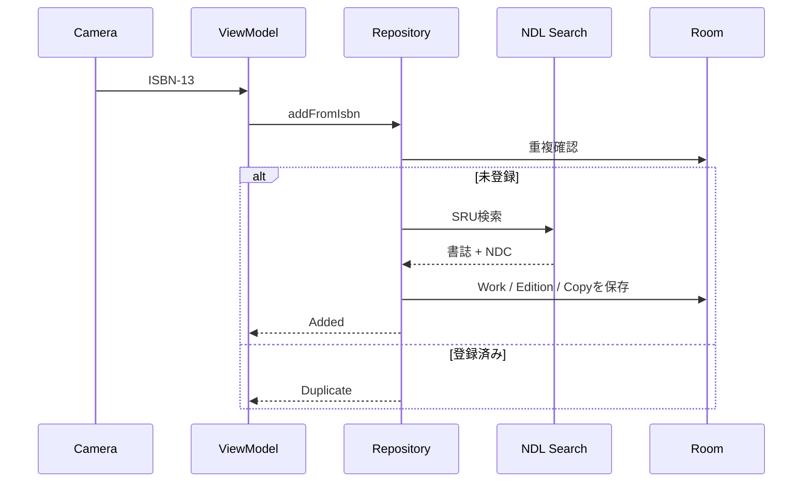
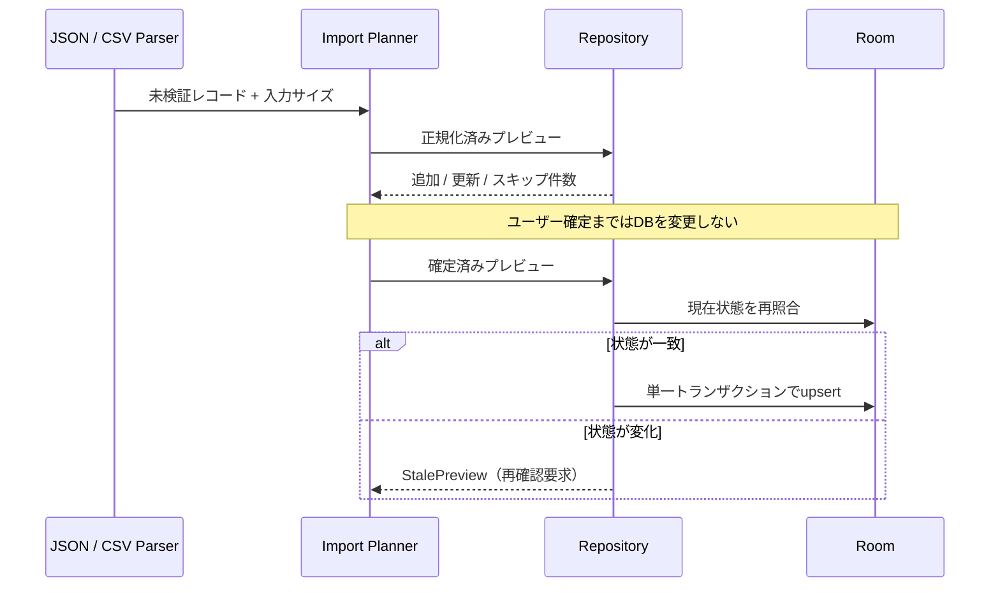
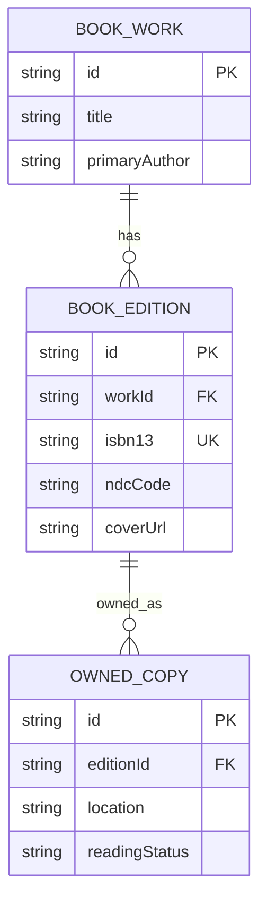

# Architecture

## 方針

NDC Shelfは、最初のリリースでは単一のAndroidアプリモジュールに保ちます。パッケージ境界で責務を分け、ビルド時間や変更頻度が分離のコストを上回った時点でマルチモジュール化します。

## パッケージ

| パッケージ | 責務 |
| --- | --- |
| `domain/model` | UIや保存方法に依存しない蔵書モデル |
| `domain/export` | バージョン付きJSONと安全なCSVの逐次出力 |
| `domain/importer` | 形式非依存の入力検証、競合解決、プレビュー、原子反映 |
| `domain/repository` | ユースケースから見たデータ操作の契約 |
| `data/local` | RoomのEntity、DAO、Database |
| `data/remote` | NDL Search SRUクライアントとXML解析 |
| `data/repository` | ローカル・リモートデータの統合 |
| `scanner` | ISBN検証とリアルタイムバーコード解析 |
| `ui` | Compose画面、テーマ、表示部品 |

## 登録フロー

## インポートフロー

形式パーサーとUIは必ず共通インポート基盤を経由します。詳細な上限、競合方針、ロールバック条件は[IMPORT_SAFETY.md](IMPORT_SAFETY.md)を参照してください。

## データモデル

`BookEdition.isbn13` は現在ユニークです。複数冊所蔵を正式に扱う段階では、既存Editionに新しいOwnedCopyを追加するユースケースを設けます。

### 手動補正の優先順位

詳細編集では、タイトル・著者を`BookWork`、出版社・出版年・NDCを`BookEdition`、置き場所・読書状態を`OwnedCopy`へ単一トランザクションで保存します。入力は保存前に前後空白、必須項目、文字数、出版年、NDCコードを検証します。

NDCコードまたはNDC版を変更した場合、`classificationSource`を`MANUAL`にします。同じISBNを再スキャンしても既存蔵書の重複判定をNDL取得より先に行うため、手動値を上書きしません。将来NDL再取得機能を追加する場合も、`MANUAL`の分類値は明示確認なしに更新してはいけません。

保存直後は変更前と変更後のスナップショットを保持し、Snackbarから取り消せます。取り消し時点のDBが保存直後の状態と一致する場合だけ、3テーブルを単一トランザクションで復元します。別操作による変更を検出した場合は復元を拒否します。

## プライバシー

- 蔵書DBは端末内に保存します。
- バーコード認識は端末内で処理します。
- 書誌情報の検索時にISBNをNDL Searchへ送信します。
- アナリティクスSDKや広告SDKは組み込みません。
- 将来の同期やAI機能は明示的なオプトインにします。
