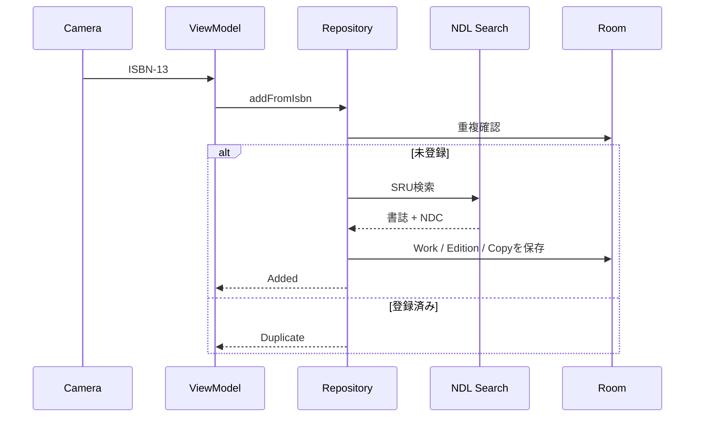
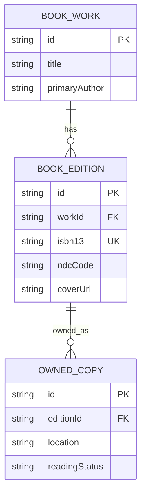

# Architecture

## 方針

NDC Shelfは、最初のリリースでは単一のAndroidアプリモジュールに保ちます。パッケージ境界で責務を分け、ビルド時間や変更頻度が分離のコストを上回った時点でマルチモジュール化します。

## パッケージ

| パッケージ | 責務 |
| --- | --- |
| `domain/model` | UIや保存方法に依存しない蔵書モデル |
| `domain/repository` | ユースケースから見たデータ操作の契約 |
| `data/local` | RoomのEntity、DAO、Database |
| `data/remote` | NDL Search SRUクライアントとXML解析 |
| `data/repository` | ローカル・リモートデータの統合 |
| `scanner` | ISBN検証とリアルタイムバーコード解析 |
| `ui` | Compose画面、テーマ、表示部品 |

## 登録フロー

## データモデル

`BookEdition.isbn13` は現在ユニークです。複数冊所蔵を正式に扱う段階では、既存Editionに新しいOwnedCopyを追加するユースケースを設けます。

## プライバシー

- 蔵書DBは端末内に保存します。
- バーコード認識は端末内で処理します。
- 書誌情報の検索時にISBNをNDL Searchへ送信します。
- アナリティクスSDKや広告SDKは組み込みません。
- 将来の同期やAI機能は明示的なオプトインにします。
