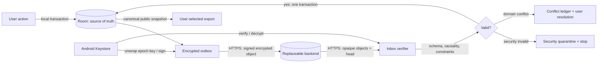

# NDC Shelf Sync Protocol v1

最終更新日: 2026-07-29

この文書の「必須」「禁止」「推奨」はprotocol v1のnormative requirementである。設計判断は[ADR 0005](adr/0005-optional-e2ee-sync.md)、脅威と残存riskは[同期脅威モデル](SYNC_THREAT_MODEL.md)を参照する。

## 1. Goals and boundaries

protocolはRoomや特定backendの内部schemaではなく、NDC Shelfの公開同期形式である。local databaseは常に正本で、通信不能でも閲覧・登録・編集・削除を許可する。同期OFFではbackend discovery、認証、鍵生成、background work、network requestを行ってはならない。

保証するもの:

- authorized device間のeventual convergence
- backendに対するpayloadの機密性
- device署名、AEAD、hash chainによる改ざん・rollback検出
- field単位の決定的な競合解決とconflict evidence
- backend交換と公開snapshot export

保証しないもの:

- real-time共同編集または複数user共有
- traffic量、時刻、IP、account metadataの匿名化
- 侵害・失効前に端末へ取得された平文の遠隔消去
- 全authorized deviceを失った場合のserver-side鍵復旧
- 端末間gossipなしでの悪意あるbackendによる選択的forkの完全検出

## 2. Data flow



backendが観測できるのはaccount用識別子、認証情報、接続IP・時刻、protocol/suite ID、epoch、object ID、暗号文長、端末公開鍵、署名、headである。entity type、entity ID、title、ISBN、author、reading status、purchase status、location、series名、operation内容、version vectorは暗号文内に置く。

### 2.1 Encryption by location

| Location | Required protection | Explicit limit |
| --- | --- | --- |
| Device domain DB | app-private internal storage、Android sandbox、OS data-at-rest encryption、lock screenを前提とする | protocol v1はSQLCipher等の二重暗号化を追加しない。root、malware、unlocked deviceは対象外 |
| Device keys | Keystoreのnon-exportable P-256 signing keyとAES-256-GCM wrapping keyを使う。wrapping keyでHPKE private keyとepoch keyを暗号化保存する | API 23〜30ではHPKE private keyが使用中にprocess memoryへ現れる。hardware-backed非対応端末も利用可能だがUIにsecurity levelを表示する |
| Outbox / inbox / quarantine | network envelopeと同じE2EE ciphertextだけをapp-private storageへ置く | 復号payloadを一時file、log、clipboardへ書かない |
| In transit | 通常の証明書検証を行うTLS 1.2以上と、AES-256-GCM E2EEを併用する | E2EEを理由にcleartext transportを許可しない |
| Backend primary / backup | E2EE ciphertextだけを保存し、provider側disk encryptionも要求する | provider側暗号だけをpayload機密性の根拠にしない |
| Manual public export | 利用者が選択した保存先へ平文を出力する前に警告する | sync key、credential、backend IDを含めない |

local Roomをapplication-levelで暗号化しない判断は、既存dataのmigration失敗と起動・検索性能のriskを増やす一方、root化またはunlocked端末では復号keyと表示平文も取得され得るためである。端末紛失への防御は安全なlock screenとOS encryptionを必須前提とし、riskが変わる場合は別ADRで再評価する。

## 3. Sync scope

### 3.1 Included domain data

| Entity | Included fields | Notes |
| --- | --- | --- |
| Work | immutable ID、title、primaryAuthor | titleとauthorはfield単位update |
| Edition | immutable ID、workId、ISBN、publisher、year、cover URL、NDC、source | parent削除はremove-wins |
| OwnedCopy | immutable ID、editionId、media、reading status、location、tierId、shelfOrderKey、label、addedAt | `addedAt`は事実値であり競合時計ではない |
| WishlistItem | editionId、status、createdAt、updatedAt | entity IDはeditionId |
| Room / Shelf / Tier | immutable ID、parent ID、name、sortOrder | 同名unique衝突はdomain conflict ledger対象 |
| Series / Membership | immutable ID、name、workId、volume label、type、order key、origin | membershipを独立競合単位にする |
| WorkGroup / Membership | immutable ID、display fields、substitution flag、workId | membershipを独立競合単位にする |

将来追加するreading history、memo、tag、collectionは、個別entityとprivacy reviewを追加しない限り同期対象へ自動追加してはならない。

### 3.2 Excluded local and derived data

| Data | Reason |
| --- | --- |
| ScanSession / ScanAttempt / undo snapshot | 操作履歴と一時的な端末状態。volumeが大きく、端末間で意味が弱い |
| SeriesWatchのenabled、query、lastChecked、lastSuccessful | external通信の同意とscheduler状態は端末単位 |
| SeriesReleaseCandidate、first/last seen、notifiedAt | NDLから再生成可能なcache・通知状態 |
| image・HTTP cache、search index、WorkManager state | 再生成可能 |
| auth token、cookie、account credential | backend認証専用。payloadへ入れない |
| device private key、epoch key、recovery material | key materialをoperationやexportへ入れない |
| analytics、crash log、IP、hardware identifier | protocol対象外。別の明示同意なしに収集しない |

除外dataがincluded entityの作成根拠であっても、確定済みdomain entityだけを同期する。新しいRoom tableは明示的なprotocol scope reviewなしに同期してはならない。

## 4. Identifiers and causal metadata

- `libraryId`: 128-bit CSPRNG。backend pathでは`SHA-256(libraryId || backendSalt)`のopaque表現を使う。
- `deviceId`: libraryごとに生成する128-bit CSPRNG。advertising ID、IMEI、Android IDを使わない。
- `entityId`: client生成の128-bit以上のrandom immutable ID。既存domain IDを保持する。
- `operationId`: `deviceId`とunsigned 64-bit `counter`の組。counterはdevice内で永続化し、再利用しない。
- `encryptionCounter`: deviceごとのunsigned 64-bit値。object作成前にtransactionalに増加・永続化し、同じdeviceIdで再利用しない。
- `transactionId`: 複数operationをatomicに適用するrandom immutable ID。
- `versionVector`: `deviceId -> highest contiguous counter`。因果関係と欠落検出に使う。
- `createdAt` / `updatedAt`: domain事実または表示用metadata。競合の勝敗、削除、認可に使わない。

deviceのoperation counterまたはencryption counterを失った場合、同じdeviceIdを再利用してはならない。新しいdeviceIdとして再登録し、既存snapshotからbootstrapする。

## 5. Public encoding

protocol v1の復号済みdocumentはRFC 8785 JSON Canonicalization Schemeに従うUTF-8 JSONである。timestampはUTC RFC 3339、binaryはunpadded base64url、64-bit counterはunsigned decimal stringとする。domain値に浮動小数点を使わず、duplicate key、不正surrogate、未知enum値のsilent coercionを禁止する。独自canonicalizerを作らず、公開fixtureに適合する保守済み実装を使う。

parserは次を満たす。

- `protocolVersion`のmajorが未知ならobject全体を拒否する。
- 同じmajorの未知optional fieldは保持して再送できるか、変更せずopaque storageへ残す。
- `requiredCapabilities`の未知値が1つでもあればapplyしない。
- objectは復号後8 MiB、transactionは1,000 operation、stringは既存import上限を超えない。
- JSON schema、example、conformance fixtureをrepositoryで公開する。

利用者向けsnapshot exportは同じdomain field名とIDを使い、`ndc-shelf-sync-snapshot-v1` media type、schema version、export timestampを持つ。credential、key、backend opaque IDは含めない。

## 6. Encrypted envelope

outer envelopeとAEADで認証する`protectedHeader`:

```json
{
  "objectId": "base64url-sha256",
  "protectedHeader": {
    "protocolVersion": "1.0",
    "suite": "P256_HKDF_SHA256_AES256GCM_ECDSA_P256_SHA256",
    "libraryOpaqueId": "base64url",
    "epoch": 1,
    "registryGeneration": 3,
    "paddedLength": 65536,
    "signingDevicePublicKeyId": "base64url-sha256"
  },
  "nonce": "base64url-96-bit",
  "ciphertext": "base64url",
  "signature": "base64url"
}
```

ciphertext payload:

```json
{
  "kind": "operations",
  "previousObjectHash": "base64url-sha256-or-null",
  "deviceId": "base64url",
  "counterRange": {"first": "1", "last": "8"},
  "versionVector": {"base64url-device-id": "8"},
  "transactions": [],
  "createdAt": "2026-07-27T00:00:00Z"
}
```

- device content subkeyはRFC 5869のextract-then-expandで導出する。`salt`は16-byteの`libraryId`、IKMは32-byteの`epochKey`、`info`はASCII `ndc-shelf-sync-v1/content`、`uint64be(epoch)`、16-byteの`deviceId`を順に連結したbytes、出力長は32 bytesとする。
- content encryptionはAES-256-GCM、tagは128-bitとする。nonceは32-bitのzero prefixとbig-endian 64-bit `encryptionCounter`を連結した96-bit値とし、同じdevice subkeyで再利用してはならない。
- `protectedHeader`のcanonical bytesをAEAD additional authenticated dataにする。
- AEAD plaintextは`uint32be(canonicalJsonByteLength) || canonicalJsonBytes || randomPadding`とする。全体を最低64 KiB、以降64 KiB単位にしてから暗号化し、8 MiB上限はpadding前のcanonical JSONへ適用する。復号後はlength境界外をJSON parserへ渡さない。
- `objectId`はcanonical `protectedHeader`、12-byte nonce、ciphertextを順に連結したbytesのSHA-256とする。各要素はouter envelopeの別fieldから復号し、nonce長を固定するため境界は一意である。`objectId`をAADへ含めず、循環参照を作らない。
- signatureはASCII `ndc-shelf-sync-v1/object-signature`、`0x00`、32-byteの`objectId`を順に連結したbytesへのECDSA P-256/SHA-256とする。署名はJCA `SHA256withECDSA`が生成するstrict ASN.1 DER形式とし、非canonical DER、末尾data、P-256範囲外の`r` / `s`を拒否する。
- signing public keyはX.509 SubjectPublicKeyInfo DER、`signingDevicePublicKeyId`はそのDER bytesのSHA-256とする。HPKE P-256 public keyはRFC 9180の`SerializePublicKey`による65-byte uncompressed SEC1形式とし、形式変換をwire境界で曖昧にしない。
- decrypt前にobject size、suite、epoch、device authorization、signature、object hashを検証する。
- encryption counterのrollback、重複、overflowを検出したdevice IDは利用停止し、新device IDと新epochへrotationする。不審objectはapplyしない。

暗号primitiveはplatform APIまたは保守されている監査済みlibraryを用い、ECDSA DER parser、HPKE、canonical JSON、nonce生成を独自実装しない。

### 6.1 HPKE device key envelope

epoch keyを新端末へ配布するHPKEはRFC 9180 base mode（`mode = 0x00`）、KEM `DHKEM(P-256, HKDF-SHA256)`（`0x0010`）、KDF `HKDF-SHA256`（`0x0001`）、AEAD `AES-256-GCM`（`0x0002`）を使う。

- `info`はASCII `ndc-shelf-sync-v1/epoch-key`、`uint64be(epoch)`、16-byte recipient `deviceId`、32-byte registry hash、32-byte head hashを順に連結する。
- AADはcanonical JSONのdevice authorizationから、HPKEの`enc`、ciphertext、signatureを除いたbytesとする。authorizationにはprotocol version、suite、library opaque ID、epoch、registry generation、registry hash、trusted head hash、sender signing key ID、recipient device ID、recipient HPKE public key、expiry、invite nonceを必須とする。
- plaintextは32-byte epoch keyだけとし、HPKE出力の`enc`とciphertextは別fieldのunpadded base64urlで保存する。
- `envelopeId`はcanonical authorization、HPKE `enc`、ciphertextを順に連結したbytesのSHA-256とする。senderはASCII `ndc-shelf-sync-v1/epoch-key-signature`、`0x00`、32-byte `envelopeId`を連結したbytesへ6節と同じECDSA encodingで署名する。recipientは署名、registry generation、registry / head hash、recipient ID、expiry、invite nonceの一回性を検証してからHPKEを開く。
- RFC 9180の公開test vectorに加え、この固定`info` / AAD / encodingのrepository fixtureを全実装で共有する。

## 7. Operations and merge rules

operationは`upsertFields`、`deleteEntity`、`acknowledge`のいずれかで、entity type、entity ID、dot、causal context、field mapを暗号文内に持つ。

### 7.1 General rules

1. 同一operation IDはidempotentに1回だけ適用する。
2. causal contextに欠落があればapplyせず、欠落objectを取得する。
3. 因果的に後のfield valueを採用する。
4. 同時field updateはdotを`deviceId bytes, counter`の順に比較した決定的winnerを表示値とし、loserをlocal conflict logへ残す。
5. 同一transaction内のoperationは全件を単一Room transactionで適用する。1件でもdomain検証に失敗したらdomain tableへは全件適用しない。
6. 参照先未到着はpendingとし、親のtombstoneがwinnerなら子も適用しない。
7. unique constraint違反を自動rename、overwrite、dropしない。署名・AEAD・schema・causalityが正しいtransactionは受信済みのdomain conflictとしてledgerへ全件保存し、利用者解決を要求する。

clientは`receivedVector`と`processedVector`を分ける。署名・schema・causalityが正しいdomain conflictはledgerへtransaction全体を保存した後に両vectorを進め、未反映entity / field IDを`unresolvedDependencies`へ記録する。後続operationは因果的なcounterだけを理由に停止せず、未解決IDを参照する場合だけpendingにする。これにより、同じdevice log上の無関係な後続operationを処理できる。signature、AEAD、schema、hash chain、causal contextが不正なobjectはsecurity quarantineとし、どちらのvectorも進めず同期を停止する。

conflict ledgerは同期対象外のlocal evidenceで、元operation、entity、field、winner、loser、device label、検出時刻、解決operation IDをapp-private storageへ保持する。同じoperation logから各端末が再構築でき、秘密値を通常logやcrash reportへ出してはならない。

### 7.2 Deletion

- deleteはentity generation全体へのtombstoneで、同時または因果的に古いupdateに対してremove-winsとする。
- tombstone後のupdateはrejectし、旧IDを自動復活させない。
- 利用者が復元する場合は新しいentity IDと参照を持つ新規作成にする。
- delete senderはprotocol schemaで定義した参照関係からcascade対象を同じtransaction内へ明示する。receiverは同じprotocol versionの期待closureと一致することを検証し、現在のRoom schemaだけから暗黙cascadeを追加しない。不一致はdomain conflictとしてtransaction全体を適用しない。
- tombstone削除は全active deviceのversion vectorがdeleteをackし、失効端末を除外し、かつ90日経過した場合だけ許可する。

### 7.3 Membership and ordering

- SeriesMembershipとWorkGroupMembershipは独立entityとしてadd/update/deleteする。parent entity全量のset置換は禁止する。
- membershipの同時追加は異なるIDなら両方保持する。domain unique constraintに違反する場合はconflict ledgerへ保存し、自動選択しない。
- shelfとseriesの順序は既存fractional order keyを同期する。同じkeyはentity IDを最終tie-breakerにして表示する。
- 同じentityの同時moveは`shelfOrderKey`または`sortOrderKey` fieldの通常競合として解決し、loserをconflict logへ残す。
- key圧縮は対象container全体の明示transactionとし、既知headへのpreconditionを要求する。precondition不一致なら再計算する。

### 7.4 Clock skew

counterとversion vectorだけを因果・競合に使う。端末時計が過去・未来へ変わってもoperation順を変えない。表示用timestampは受信時に異常値を示せるが、remote値へ自動補正しない。

## 8. Keys, authentication, and devices

### 8.1 Initial opt-in

1. 送信対象、除外対象、metadata、鍵紛失時挙動、backendをpreviewする。
2. backend adapterが要求する認証を行う。OAuthを使うnative adapterはauthorization code + PKCEを必須とする。filesystem等のaccount不要adapterはこの手順を省略する。
3. P-256 signing keyとAES-256-GCM wrapping keyをAndroid Keystoreへ生成する。hardware-backed statusを記録するが、非対応端末を排除しない。
4. RFC 9180 HPKE用P-256 recipient key pairと256-bitのepoch 1 keyをCSPRNGで生成し、private keyとepoch keyをKeystore wrapping keyで暗号化してapp-private storageへ保存する。backendが保持するroot keyやescrow keyは作らない。`epoch`と`registryGeneration`は0を禁止したunsigned 32-bit整数とし、JSONで正確に表現できる範囲を超えない。
5. device公開鍵、署名済みdevice registry、HPKE-wrapped epoch key、空headをbackendへ登録する。
6. 最初のencrypted snapshot uploadが成功してから同期ONを確定する。失敗時はremote partial stateを削除し、local dataを変更しない。

E2EE key、auth token、device private keyはAndroid backup、domain backup、logs、clipboardへ含めない。HPKE private keyとepoch keyの平文は暗号operation中だけmemoryへ置き、使用後に可能な範囲でzeroizeする。Keystore wrappingは`setRandomizedEncryptionRequired(true)`のAES-256-GCMにnonce生成を委ね、返された96-bit nonceと128-bit tagを保存し、key種別・library ID・key versionをAADで認証する。caller指定nonceを使わず、wrapped blobはnonce、ciphertext、tag、key alias versionを持つ。Keystore operationはmain threadで行わない。Android API 31で追加された`PURPOSE_AGREE_KEY`をv1の必須条件にせず、API 23〜最新APIで同じwire suiteを使う。

### 8.2 Add and revoke device

- 新端末はbackend認証だけでは復号権限を得ない。既存authorized deviceが表示する短時間・一回限りのQRをscanし、双方が表示する6桁以上のverification codeを照合する。
- 既存端末は新端末公開鍵、device ID、expiry、nonceを含むauthorizationへ署名し、current epoch keyをHPKEでwrapする。
- 既存端末はauthorizationに固定したtrusted headを基にcurrent epochで新しいbootstrap snapshotを作る。新端末はそのsnapshotと以後のcurrent-epoch operationから開始し、過去epoch keyを受け取らない。
- QR secret、authorizationは10分で失効し、一度使ったnonceを再利用しない。backendは未使用状態をatomicに消費する。
- 端末失効はregistry generationを進める署名済みremove operationと新epoch作成を同一管理transactionで行う。失効端末へ新keyをwrapしない。
- envelopeは作成時のregistry generationをAEADで認証する`protectedHeader`に持つ。active clientは失効generation以後に旧端末が作成したobjectを拒否する。失効端末の未同期編集は自動取込せず、必要なら利用者が別端末で再入力する。
- offline中の端末失効は次回接続まで他端末へ伝播しない。失効端末が既に持つ旧dataは消去できないことをUIへ表示する。

### 8.3 Key loss

- Keystore keyが無効化・消失した端末は自動的に新端末として扱い、別authorized deviceから再追加する。
- authorized deviceが1台でも残れば新端末を追加できる。
- 全authorized deviceと利用者が作成したlocal完全backupを失った場合、backendはE2EE keyを持たないため復旧できない。
- protocol v1はpassword escrow、security question、運営者recovery keyを提供しない。「password resetで蔵書も戻る」と表示してはならない。

### 8.4 Sign-out, consent withdrawal, account deletion

- sign-outはtokenを失効・削除し、WorkManagerをcancelし、network clientを破棄する。local domain dataは削除しない。
- 同期同意撤回は新requestを停止する。remote dataを残すか全削除するかを別に確認し、沈黙を削除同意とみなさない。
- remote full deleteは直前のlocal完全backupを推奨し、再認証と明示確認後に全opaque object、head、wrapped key、device registry、account mappingの削除をbackendへ要求する。
- backendは即時access停止と30日以内のphysical deletion、またはより短い公開policyをcapabilityで宣言する。法令・障害backupの例外と最終削除日をreceiptで返す。
- remote削除後も各端末のlocal dataは残る。全端末のlocal data削除は各端末で別操作とし、遠隔保証しない。

## 9. Backend contract

adapterは少なくとも次を提供する。

- `getCapabilities()`
- `createLibrary(initialRegistry, initialHead)`
- `getHead(ifNoneMatch)`
- `compareAndSetHead(expectedEtag, newHead)`
- `putObjectIfAbsent(objectId, bytes)`
- `getObject(objectId, byteRange?)`
- `listDeviceEnvelopes()`
- `putDeviceEnvelopeIfAuthorized()`
- `requestRemoteDeletion()` / `getDeletionReceipt()`

capabilityはprotocol major/minor、suite、max object size、CAS、retention、deletion SLA、rate limit、export availabilityを認証済みchannelで返す。HTTPS adapterは通常の証明書検証で応答元を認証し、offline adapterは利用者が選択した保存先を信頼境界とする。追加の署名を使うadapterは、信頼鍵の配布・rotationをadapter仕様で定義する。必須capability不一致ではuploadを開始しない。objectはcontent-addressedかつimmutableで、同じIDへ異なるbytesを保存してはならない。

headはlibrary generation、current epoch、snapshot object ID、各device log head、registry hashを含む。clientは前回確認したheadまたはそのdescendantだけを受け入れる。古いhead、署名chain欠落、CAS競合ではlocal dataを変更せず再取得する。

## 10. Sync cycle, failure, and rollback

1. local mutationとoutboxを同一Room transactionでcommitする。
2. network制約を満たした明示syncまたは一意background workがcapabilityとheadを取得する。
3. remote objectをsize制限付きで取得し、hash、署名、authorization、AEAD、schema、causalityを順に検証する。
4. valid transactionだけを単一DB transactionでapplyし、適用前に自動snapshotを`noBackupFilesDir`へ作る。
5. local outboxをencrypt・signし、immutable object upload後にheadをCAS更新する。
6. CAS conflictは新headをpullしてmergeし、上限付きexponential backoff + jitterで再試行する。
7. ack後もlocal outboxを直ちに破棄せず、compaction checkpointまで保持する。

backend停止、timeout、429、5xxではlocal operationを保持してoffline表示を続ける。認証失敗は自動retryせず再認証を要求する。署名、AEAD、hash chain、schema、causality失敗はsecurity errorとして同期を停止し、objectをsize制限付きquarantineへ保存する。domain constraint違反はsecurity errorへ混在させずconflict ledgerへ保存し、他の独立operationを継続する。

誤同期またはapp bug時は最後のgood snapshotへtransactional restoreし、remote headを上書きしない。修正版clientが新しいcorrective operationまたはsnapshotを作り、CASでroll forwardする。Android app downgradeとDB destructive migrationをrollbackに使わない。

compactionは全active deviceがcheckpointまでackした場合だけ、新しいencrypted snapshotと署名済みmanifestを作る。旧object/tombstoneの削除はretention規則を満たしてから行う。

## 11. Versioning and compatibility

- `protocolVersion`は`major.minor`。破壊的変更、canonicalization変更、競合意味変更はmajorを上げる。
- optional field・entity追加はminorで行えるが、未知fieldの保持とcapability negotiationを必須にする。
- algorithm変更は新しい`suite` IDを追加し、既存suite IDの意味を変更しない。
- clientはdownload前にcapability、apply前にprotocolとrequired capabilitiesを検査する。
- downgrade clientがunknown required capabilityを見た場合はread-only local modeへ留まり、remote headを更新しない。
- protocol v1のschema、fixture、公開snapshot exporterは少なくともv1を利用するreleaseのsupport期間中保持する。

## 12. Conformance and release gates

- canonical JSON、HPKE、AES-GCM、ECDSAは公開known-answer fixtureで相互運用を検証する。
- nonce重複、ciphertext・header・signature改ざん、unauthorized device、replay、rollback、forkをnegative testに含める。
- 2端末のoffline同時編集、同時削除、parent/child削除、membership重複、同時move、時計±10年をproperty testする。
- process kill、network切断、CAS競合、backend 429/5xx、8 MiB超、欠落objectでlocal dataとoutboxを保持する。
- revoke、Keystore invalidation、全鍵紛失、sign-out、consent withdrawal、remote purgeをemulatorまたは実機で検証する。
- backend adapterごとに同じconformance suiteを実行し、独自の競合規則を許可しない。

## 13. Standards references

- [Android Keystore](https://developer.android.com/privacy-and-security/keystore)
- [Android `PURPOSE_AGREE_KEY` API level](https://developer.android.com/reference/android/security/keystore/KeyProperties#PURPOSE_AGREE_KEY)
- [RFC 9180: Hybrid Public Key Encryption](https://www.rfc-editor.org/rfc/rfc9180.html)
- [RFC 5869: HKDF](https://www.rfc-editor.org/rfc/rfc5869.html)
- [RFC 8785: JSON Canonicalization Scheme](https://www.rfc-editor.org/rfc/rfc8785.html)
- [NIST SP 800-38D: AES-GCM](https://csrc.nist.gov/pubs/sp/800/38/d/final)
- [RFC 7636: OAuth PKCE](https://www.rfc-editor.org/rfc/rfc7636.html)
- [RFC 8252: OAuth 2.0 for Native Apps](https://www.rfc-editor.org/rfc/rfc8252.html)
