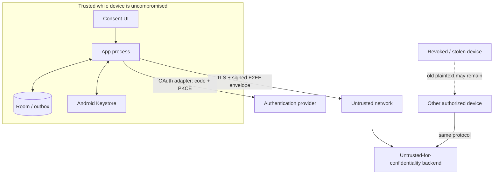

# 任意同期の脅威モデル

最終更新日: 2026-07-29

## 1. Problem and security objectives

同期対象には、title・author・ISBN・NDC、reading status、purchase status、自由入力の部屋・棚・段、seriesと版の関係が含まれる。これらは利用者の関心、思想、健康、経済状況、生活環境を推測し得る。同期機能は既定OFFで、端末内機能から独立しなければならない。

- **Confidentiality**: authorized device以外はdomain payloadを復号できない。
- **Integrity**: unauthorized・改ざん・replay・rollbackされたobjectをRoomへ適用しない。
- **Availability**: backend障害、account障害、network partitionでlocal利用と未送信編集を失わない。
- **User control**: 同意、送信対象、端末、撤回、remote削除、鍵紛失の結果を操作前に示す。
- **Portability**: backend停止時もlocal snapshotを公開形式でexportできる。

## 2. Assets, actors, and trust boundaries

| Asset | Impact if exposed or altered |
| --- | --- |
| Domain payload | 読書傾向、思想・健康、購入、物理的生活環境の推測 |
| Library epoch key / HPKE private key | 対象epochの全payload復号、将来key envelopeの復号 |
| Device signing private key | authorized deviceとしてoperation・registry変更を署名 |
| Auth credential | opaque objectの取得、削除、metadata列挙 |
| Device registry / head | unauthorized device追加、rollback、fork、availability喪失 |
| Local Room / outbox / tombstone | 確定data喪失、resurrection、非収束 |
| Recovery snapshot | 全domain payloadと内部IDの漏えい |

actorsは利用者、authorized device、失効端末、network attacker、honest-but-curious backend、侵害されたbackend、認証provider、端末上のmalware、誤動作client、repository contributorである。

Android Keystoreはsigning keyとwrapping keyのextraction耐性を高めるが、API 23〜30互換のHPKE private key、epoch key、復号payloadは使用中にapp process memoryへ現れる。compromised processやroot化端末から平文を守る境界とはみなさない。backendはavailabilityとobject保管には信頼するが、payload機密性と完全性には信頼しない。

端末内domain DBはapp-private storage、Android sandbox、OS data-at-rest encryptionで保護し、protocol v1ではapplication-level DB暗号を追加しない。同期outbox、inbox、quarantineはE2EE ciphertextのまま保存する。backendはprimary storageとbackupのdisk encryptionを提供しなければならないが、backend侵害への機密性はE2EEだけを根拠にする。

## 3. STRIDE analysis

| Category | Threat | Control | Required verification | Residual risk |
| --- | --- | --- | --- | --- |
| Spoofing | 攻撃者がdeviceを追加する | backend認証に加え、既存device署名、一回限りQR、verification code、10分expiry。OAuth adapterはPKCE必須 | unauthorized/replayed inviteを拒否 | 既存unlocked deviceを操作された場合は承認され得る |
| Spoofing | backendがdevice operationを偽造する | Keystore P-256 keyによるenvelope・registry署名 | unknown/revoked key、改ざん署名を拒否 | signing keyを使用できるmalwareは偽装可能 |
| Tampering | ciphertext、header、head、順序を改ざんする | AES-GCM AAD、SHA-256 object ID、署名、per-device hash chain、CAS head | bit flip、object置換、欠落、古いheadをfail-closed | backendの選択的forkはdevice間比較なしで完全検出できない |
| Tampering | 競合でfieldやmembershipをsilent dropする | version vector、field conflict ledger、membership独立entity、unique衝突のreceived / processed vectorと未解決依存の分離 | property testと2実装conformance | winner選択は利用者意図と異なる場合がある |
| Repudiation | どのdeviceが変更・削除したか否認する | signed operation ID、device label、local conflict/audit evidence | signatureとcounter chain検証 | device共有者個人までは特定しない |
| Information disclosure | backend侵害で蔵書を読む | E2EE、backendにkeyを置かない、padding | backend dumpに平文・keyがない | traffic時刻、IP、object数・size、account関係は露出 |
| Information disclosure | logs、crash report、backupにkeyやtitleを出す | structured redaction、key/export除外、analyticsなし | log scan、backup policy、secret scan | OS memory dump、root端末は対象外 |
| Information disclosure | 失効端末が今後のdataを読む | epoch rotation、新keyをwrapしない | revoke後のnew object decrypt失敗 | 旧epoch keyと既取得平文は消去不能 |
| Denial of service | backend停止、429、object削除 | local-first、durable outbox、bounded retry、public export | partition・429・5xx・missing object test | 長期停止中は端末間収束しない |
| Denial of service | 巨大vector、operation flood | ciphertext/復号size、transaction件数、device数、string長上限 | boundary/fuzz test | authorized悪性deviceは上限内で負荷を与えられる |
| Elevation of privilege | auth tokenだけでpayload keyを得る | account authとdevice authorization/E2EE keyを分離 | token-only device addを拒否 | authorized device compromiseでは両権限が揃う |
| Elevation of privilege | downgrade clientが未知operationを上書きする | required capabilities、major version gate、read-only fail-closed | downgrade compatibility test | 古いclientのlocal-only変更はupgradeまで未送信 |

## 4. Abuse and failure cases

### Backend compromise

侵害者はopaque objectとmetadataを読取り、削除、遅延、replay、forkできる。payloadはE2EE、operationはdevice署名で保護する。clientはknown headのancestorを拒否し、欠落chainをapplyしない。侵害判明時は同期を停止し、local snapshotを作成し、新backend・library ID・epoch keyへauthorized deviceからre-seedする。旧backend credentialを失効しremote purgeを要求する。

### Device theft or compromise

別authorized deviceから対象deviceを失効し、epoch rotationする。利用者には「今後の同期を停止する」操作であり、既取得dataのremote wipeではないと示す。最後のdeviceを失った場合、backend認証だけでは復号できない。残るlocal完全backupからlocal libraryを復元し、新しいsync libraryとして再登録する。

### Incorrect sync or client bug

受信batchは自動snapshot後に単一transactionでapplyする。signature、AEAD、schema、causalityに失敗したbatchはsecurity quarantineとして停止する。正当だがdomain constraintに違反するbatchは受信済みconflict ledgerへ全件保存し、domainへ一部適用しない。誤適用を検出した場合はlast-good local snapshotへrestoreし、remote headを巻き戻さずcorrective operationまたは新snapshotでroll forwardする。

### Account deletion and backend shutdown

remote full deleteは再認証、明示確認、削除receiptを要求する。backend停止時もlocal exportを可能にする。backendが削除不能ならcredentialを失効し、新backendへ新library ID・keyで移行する。旧backendに残るciphertextはkey削除によりcryptographic erasure相当になるが、metadataのphysical deletionを保証するものではない。

## 5. Privacy minimization

- device IDはlibrary単位random値とし、hardware IDを使わない。
- entity type、entity ID、version vectorを含むoperation metadataは暗号化する。
- objectを64 KiB単位へpaddingし、小さい変更内容の推測を抑える。
- background syncは一意work、network接続、battery-not-low、利用者が選んだ頻度を守る。
- backend analytics、広告、training、内容scanをprotocol要件にしない。追加する場合は別のopt-inとprivacy reviewを要求する。
- privacy policyと送信previewにはbackend、対象data、除外data、可視metadata、頻度、retention、削除SLA、鍵紛失時挙動を表示する。

## 6. Key lifecycle and cryptographic failure

| Event | Required behavior |
| --- | --- |
| Initial opt-in | epoch/HPKE keyをCSPRNG生成し、Keystore signing/wrapping keyで保護。initial snapshot成功前はONにしない |
| Add device | 既存device承認、短時間QR、verification code、HPKE wrap |
| Revoke device | registry removeとepoch rotation。失効deviceへnew keyを配布しない |
| Keystore invalidation | 同期停止。別authorized deviceから新deviceとして再登録 |
| Encryption counter rollback / reuse | 対象device IDを停止し、新device IDとepochへrotation。不審objectをapplyしない |
| Algorithm weakness | affected suiteのupload停止、新suite・epochへroll forward、旧dataを再暗号化 |
| All keys lost | backend復旧不可。local完全backupがなければremote ciphertextは利用不能 |
| Remote purge | object、head、wrapped key、registry、mapping削除。端末local dataは別操作 |

## 7. Non-goals and assumptions

- device OS、Android Keystore、CSPRNG、採用crypto libraryが仕様どおり動作することを前提とする。
- root化、悪意あるOS、debugger、accessibility abuse、ロック解除済み端末を操作できる攻撃者の完全防御は対象外である。
- 利用者間library共有、権限role、共同編集のaccountabilityはv1対象外である。
- global passive adversaryに対するtraffic analysis耐性、Tor、private information retrievalは対象外である。
- backendが保持済みmetadataを法令・backupから即時physical deleteできるとは保証しない。
- cryptographyはdata correctnessを保証しない。正当に署名された誤編集は競合・履歴・backupで回復する。

## 8. Security release gates

- protocolとcrypto実装はsecurity reviewerによる設計・code reviewを必須とする。
- 依存libraryのversion、license、脆弱性、Android API 23〜最新APIでのprovider差を確認する。
- known-answer、tamper、fuzz、property、2-device partition、revoke、key loss、rollback testをCIへ追加する。
- release buildでdebug log、test endpoint、固定key、certificate trust bypass、cleartext trafficがないことを検査する。
- penetration testまたは独立実装とのinteroperability testなしに「end-to-end encrypted」をrelease文面へ記載しない。
- 未公開の暗号・認証脆弱性はpublic Issueへ書かず、`SECURITY.md`のprivate reporting経路を使う。

## 9. References

- [Android Keystore](https://developer.android.com/privacy-and-security/keystore)
- [Android `PURPOSE_AGREE_KEY` API level](https://developer.android.com/reference/android/security/keystore/KeyProperties#PURPOSE_AGREE_KEY)
- [RFC 9180: HPKE](https://www.rfc-editor.org/rfc/rfc9180.html)
- [RFC 5869: HKDF](https://www.rfc-editor.org/rfc/rfc5869.html)
- [RFC 8785: JSON Canonicalization Scheme](https://www.rfc-editor.org/rfc/rfc8785.html)
- [NIST SP 800-38D: AES-GCM](https://csrc.nist.gov/pubs/sp/800/38/d/final)
- [RFC 8252: OAuth 2.0 for Native Apps](https://www.rfc-editor.org/rfc/rfc8252.html)
- [OWASP MASVS](https://mas.owasp.org/MASVS/)
